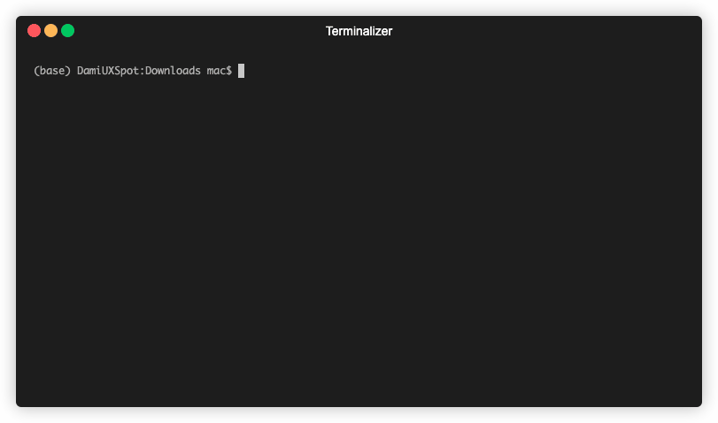

# Customer Reviews Scraper

Customer reviews go a long way in helping businesses and individuals make mission-critical decisions. Hence, the creation of apps like this, that helps to scrape the internet for useful information.

This version of the app is designed for movie lovers to check out reviews of movies by critics and the audience, from the famous Rotten Tomatoes (an American review-aggregation website for film and television)

## Built With
* Ruby
* Nokogiri

## Video Explanation

Here is the [video explanation](https://www.loom.com/share/fe7e6d6b89be4cdc93f67d9be69795ff) of this project.

## Prerequisities

To get this project up and running locally, you must already have little experience working with Ruby and have it installed

## Setting up project

**Step 1: ** Clone the repo

`git clone git@github.com:oracleot/customer-reviews-scraper.git`

**Step 2: ** Move into project directory

`cd customer-reviews-scraper`

**Step 3: ** Install necessary gems

`bundle install`

**Step 4: ** Run the app

`bin/main`

## Testing
Simply run `rspec` from the root directory

## Author
👤 **Damilola Oduronbi**

Github: [/oracleot](https://github.com/oracleot) 
LinkedIn: [/doduronbi](https://www.linkedin.com/in/doduronbi/)

## Contributing
Ideas are welcome! Feel free to visit the issues page to drop your suggestions

## License
This project has no license
